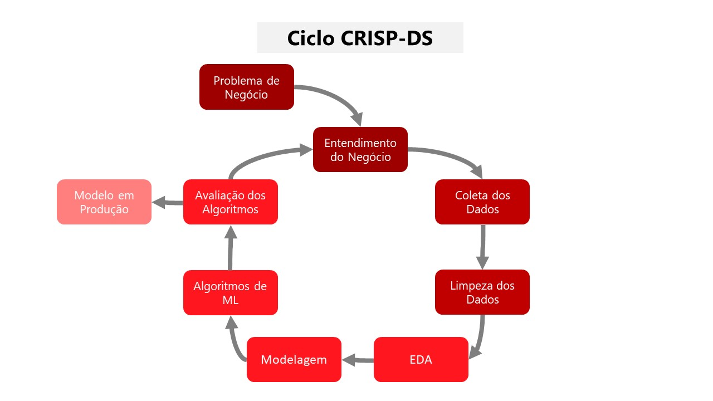
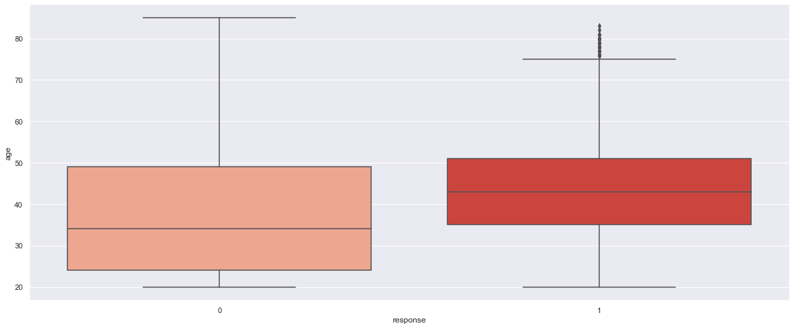

# Rankeamento de clientes para oferta de um seguro de automóvel (cross sell)

# 1. Questão de negócio

A **Insurance All** (empresa fictícia) é uma empresa tradicional que atua no segmento de seguros de saúde.  Com o objetivo de expandir os seus negócios, a empresa realizou uma pesquisa com os seus atuais clientes para saber se eles teriam interesse em contratar um seguro de automóvel. O novo seguro foi desenvolvido e ofertado aos que demonstraram interesse.

Porém, uma parcela de 76 mil clientes, novos e legado, não respondeu a pesquisa. O call center ficou responsável pela oferta do seguro de automóvel para estes clientes, mas eles só tem capacidade para ofertar para 20 mil destes potenciais clientes. 

Diante desta restrição, foi requisitado pelo Diretor de Vendas da empresa, uma lista ordenada dos potenciais clientes baseada na probabilidade de contratação do seguro, a fim de otimizar a conversão, recursos e o faturamente da empresa.

## 1.1 Desafio

Como Cientista de Dados, o meu objetivo é responder as seguintes perguntas:

1. **Quais são os principais insights sobre os atributos mais relevantes de clientes interessados em seguro veicular?**

2. **Qual a porcentagem de clientes interessados em seguro veicular o call center conseguirá contatar fazendo 20 mil ligações?**

3. **Se a capacidade do call center aumentar para 40 mil ligações, qual a porcentagem de clientes interessados em adquirir um seguro veicular o call center conseguirá contatar?**

4. **Quantas ligações o call center precisa fazer para contatar 80% dos clientes interessados em adquirir um seguro veicular?**

# 2. Premissas de negócio

O time de vendas utiliza o Google Sheets como ferramenta corporativa, portanto, é necessário que a lista ordenada com a propensão de compra seja integrada nele.

# 3. Planejamento da solução

## 3.1 Entendimento do negócio:

- **Qual é a propensão de contratação do seguro de automóvel de cada cliente?**
    - **Qual é a motivação?**  
    Diante da expansão do negócio para seguros de automóveis, foi requisitado pelo Diretor de Vendas uma lista ordenada dos potenciais clientes, de acordo com a propensão à contratação

    - **Qual é a causa raiz do problema?**  
    Falta de capacidade da equipe de vendas (call center) para oferecer o seguro de automóvel para todos os clientes potenciais

    - **Quem é o dono do problema?**  
    Diretor de Vendas da Insurance All

    - **Qual é o formato da solução?**  
    **Granularidade**: Score de propensão por cliente  
    **Tipo de problema**: Modelo de propensão e rankeamento  
    **Potenciais métodos**: Algoritmos de Classificação  
    **Produto final**: Uma funcionalidade dentro do Google Sheets que ordena os clientes por propensão de compra 

## 3.2 Processo
### 3.2.1 Estratégia da solução
A metodologia utilizada para resolver este problema é a [CRISP-DS](https://blog.magrathealabs.com/crisp-ds-cyclic-methodology-for-data-science-projects-10c7d00fbc85), o objetivo é entregar valor o mais rápido possível para o negócio e melhorar continuamente a solução. A estratégia é detalhada no plano a seguir:

 
 **1 DESCRIÇÃO DOS DADOS**
- Coleta dos dados em um banco de dados na AWS Cloud
- Entendimento do significado de cada atributo da base de dados
- Renomeação das colunas, entendimento da dimensão e tipo dos dados
- Tratamento de dados nulos
- Análise dos atributos através de estatística descritiva

 **2 FEATURE ENGINEERING**
- Criação de mapa mental de hipóteses do negócio
- Criação de novas features necessárias para a validação das hipóteses

**3 FILTRAGEM DOS DADOS**
- Filtragem dos registros e atributos de acordo com as restrições do negócio

**4 ANÁLISE EXPLORATÓRIA DE DADOS (EDA)**
- Análise univariada para avaliação dos detalhes de cada atributo, incluse a variável target
- Análise bivariada para validação das hipótestes criadas e geração de insights para o negócio
- Identificação da relevância estimada dos atributos para o aprendizado dos modelos

**5 PREPARAÇÃO DOS DADOS (DATAPREP)**
- Padronização dos atributos numéricos com distribuição normal
- Rescaling dos atributos numéricos com distribuição não normal
- Transformação dos atributos categóricos em atributos numéricos
- Aplicação das transformações realizadas nos dados de teste

**6 FEATURE SELECTION**
- Separaração dos dados em treino e validação
- Aplicação de algoritmo de árvores para obter a sugestão dos atributos mais importantes
- Análise do resultado em conjunto com os atributos relevantes estimados na EDA
- Seleção dos melhores atributos para treinar os modelos de machine learning

**7 MODELOS DE MACHINE LEARNING**
- Aplicação dos algoritmos de classficação: KNN, Logistic regression, Random Forest e XGBoost
- Plot das curvas de ganho cumulativo e lift
- Cálculo da precison@k e recall@k de cada modelo
- Comparação da precison@k e recall@k de cada modelo
- Escolha do algoritmo

**8 OTIMIZAÇÃO DOS HIPERPARÂMETROS**
- Próximo ciclo CRISP_

**9 PERFORMANCE DO MODELO NO NEGÓCIO**
- Respostas das questões de negócio
- Comparação dos resultados da lista aleatória (baseline) com a lista ordenada por propensão de compra
- Tradução da performance do modelo em resultados financeiros para a Insurance All

**10 DEPLOYMENT DO MODELO**
- Criação das classe HealthInsurance e API
- Teste do API localmente
- Publicação do modelo na Heroku Cloud
- Criação Apps Script em Google Sheets para consultar o modelo em produção
- Criação de botão que consulta API do modelo e calcula a propensão de compra dos clientes no Google Sheets
## 3.3 Ferramentas
Quais ferramentas serão utilizadas no processo?
- Python, Numpy, Pandas, Matplotlib, Seaborn
- Anaconda, VSCode, Jupyter Notebook
- Git, GitHub
- Miro - Mind Maps
- Algoritmos de Classificação: Sklearn e XGBoost
- Flask e Heroku
- Google Sheets Apps Script

## 3.4 Dataset
Para responder a pergunta do Diretor de Vendas, foi utilizado um *dataset* público disponível no [Kaggle](https://www.kaggle.com/datasets/anmolkumar/health-insurance-cross-sell-prediction) com informações sobre a Insurance All.

| Variável | Definição |
| --- | --- |
| Id | Identificador único do cliente |
| Gender |Gênero do cliente |
| Age | Idade do cliente |
| Driving License  | 0, o cliente não tem permissão para dirigir e 1, o cliente tem permissão para dirigir |
| Region Code | Código da região do cliente |
| Previously Insured | 0, o cliente não tem seguro de automóvel e 1, o cliente já tem seguro de automóvel |
| Vehicle Age | Idade do veículo |
| Vehicle Damage | 0, cliente nunca teve seu veículo danificado no passado e 1, cliente já teve seu veículo danificado no passado |
| Anual Premium | Valor que o cliente pagou à empresa pelo seguro de saúde anual |
| Policy sales channel | Código anônimo para o canal de contato com o cliente |
| Vintage | Número de dias que o cliente se associou à empresa através da compra do seguro de saúde |
| Response | 0, o cliente não tem interesse no seguro de automóvel e 1, o cliente tem interesse no seguro de automóvel (target) |

# 4. Mapa mental de hipóteses

Na etapa de EDA, foram gerados alguns insights ao time de negócio através da validação das hipóteses levantadas.

## 4.1 Top 3 insights do negócio
1. **H1: Quanto maior a idade, maior a taxa de contratação do seguro**
**FALSA** Entre as idades de 35-50 anos é onde tem a maior taxa de aceitação do seguro
Insight: Possibilidade de criar campanhas de marketing, comunicação e até precificação de acordo com idade do público

Gráfico: Boxplot da idade por interesse no seguro de automóvel

Gráfico: Taxa de interesse por idade

2. **H6: Se o veículo já foi danificado, maior é a taxa de contratação**
**VERDADEIRA** Obs.: Praticamente todos que não tiveram o carro danificado no passado não contratariam
Insight: Oferecer planos de seguro diferente para quem nunca teve o carro danificado, até mesmo descontos para poder aumentar o interesse desse público

Gráfico: Contagem do interesse por histórico de veículo danificado

3. **H10: Se o cliente já possuí seguro com outra seguradora, menor é a taxa de contratação**
**VERDADEIRA** Obs.: Praticamente todos que já tem um contrato anterior, não tem interesse
Insight: Entender melhor esses clientes com outras informações, pesquisas, benchmarking

Gráfico: Contagem do interesse por cliente já assegurado em outra seguradora

# 5. Aplicação dos algoritmos de Machine Learning e métricas

Na etapa de Machine Learning, foram utilizados 4 algoritmos supervisionados diferentes: KNN, Logistic Regression, Random Forest e XGBoost. Para avaliação do modelo foi plotada as curvas de ganho e lift e comparados as métricas de precision@k e recall@k.

- Conceitos importantes:
    * Curva de ganho acumulado: % de interessados que podemos atingir, dado um percentual da base abordada.
    * Curva de lift: Quantas vezes o modelo preditivo (lista ordenada) é melhor que a lista aleatória, dado um percentual da base abordada.
    [Para_saber_mais](https://www.listendata.com/2014/08/excel-template-gain-and-lift-charts.html)
    * Precision@k: previsões corretas até k  dividido por todas as previsões feitas até  k
    * Recall@k: previsões corretas até k  dividido por todos interessado (target 1)

* **KNN**

Curvas de ganho e lift do modelo KNN

* **Logistic Regression**

Curvas de ganho e lift do modelo Logistic Regression

* **Random Forest**

Curvas de ganho e lift do modelo Random Forest

* **XGBoost**

Curvas de ganho e lift do modelo XGBoost

* **Precision@k e Recall@k** 

Utilizando k como 20000, as métricas de precision e recall são as seguintes:

| Model Name | Precision@k | Recall@k |
| --- | --- | --- |
| XGBoost | 33.1% | 71.6% | 
| Logistic Regression | 32.3% | 69.8% | 
| Random Forest | 30.6% | 66.0% |
| KNN | 28.3% | 61.1% |

Usando a métrica recall@k como referência, podemos fazer a seguinte interpretação:
Se o call center ligar para 20 mil clientes, o modelo XGBoost atingiria 71,6% dos interessados, o Logistic Regression 69,8% e assim sucessivamente.

Portanto, o algoritmo XGboost teve o melhor resultado segundo as métricas, mas o modelo Logistic Regression tem um resultado bem próximo.

Mesmo que o XGBoost teve um resultado melhor, foi escolhido o modelo Logistic Regression para ser colocado em produção, pelo simples fato dele ser mais leve que o XGBoost e, como a hospedagem do modelo está sendo em uma cloud Free (Heroku), isso deve ser levado em conta.

# 6. Resultados do negócio
Definido o modelo, é possível responder as questões de negócio, criar alguns cenários e estimar o benefício de seguir a solução proposta por esse projeto.

* Premissas para cálculo da performance do modelo:

    * A base de clientes em que foi feito o rankeamento, existem 76.222 clientes, onde 9.256 estão interessados no seguro de veículos
    * O ticket médio anual para um seguro de saúde da Insurance All é de $ 30.564, será utilizado o mesmo valor ticket médio para o seguro veicular
    * Está sendo desprezado os custos envolvidos na operação por falta de informação
    * Todos os clientes que demonstraram interesse na pesquisa irão aceitar o contrato
    * Cálculo receita baseline: Total interessados * Percentual de interessados abordados aleatoriamente * ticket médio seguro
    * Cálculo receita modelo: Total interessados * Percentual de interessados abordados segundo o modelo * ticket médio seguro
    * **Cálculo benefício: Receita modelo - Receita Baseline**

## **Cenário 1:** Qual a porcentagem de clientes interessados em seguro veicular o call center conseguirá contatar fazendo 20 mil ligações?
BENEFÍCIO ESTIMADO: $ 123 MM (2.66x maior que o baseline)

Curvas de ganho e lift para 20 mil ligações

    * Pela abordagem aleatória a equipe de vendas atinge 26% dos interessados. A receita anual estimada por abordagem aleatória (baseline) para 20k abordados é de: $ 74 MM
    * Pela lista ordenada a equipe de vendas atinge 70% dos interessados.A receita anual estimada segundo o modelo para 20k abordados é de: $ 198 MM
    * O benefício estimado é de: $ 123 MM
    * O lift (quantas vezes o modelo é melhor que o baseline) é de: 2.66 vezes, conforme intersecção entre linha pontilhada vermelha e curva laranja (Lift Curve)

## **Cenário 2:** Se a capacidade do call center aumentar para 40 mil ligações, qual a porcentagem de clientes interessados em adquirir um seguro veicular o call center conseguirá contatar?
BENEFÍCIO ESTIMADO: $ 132 MM (1.89x maior que o baseline)

Curvas de ganho e lift para 40 mil ligações

    * Pela abordagem aleatória a equipe de vendas atinge 52% dos interessados. A receita anual estimada por abordagem aleatória (baseline) para 40k abordados é de: $ 148 MM
    * Pela lista ordenada a equipe de vendas atinge 99% dos interessados.A receita anual estimada segundo o modelo para 40k abordados é de: $ 281 MM
    * O benefício estimado é de: $ 132 MM
    * O lift (quantas vezes o modelo é melhor que o baseline) é de: 1.89 vezes, conforme intersecção entre linha pontilhada vermelha e curva laranja (Lift Curve)

## **Cenário 3:** Quantas ligações o call center precisa fazer para contatar 80% dos clientes interessados em adquirir um seguro veicular?
BENEFÍCIO ESTIMADO: A lista ordenada faz 37 mil abordagens a menos para atingir 80% dos clientes. (2,55x melhor que a abordagem aleatória)

Curvas de ganho e lift para atingir 80% dos interessados

    * A abordagem aleatória (baseline) deve fazer 61k de contatos para atingir os 80% dos interessados
    * A lista ordenada deve fazer 24k de contatos para atingir os 80% dos interessados
    * A lista ordenada faz 37k abordagens a menos que a aleatória
    * O lift (quantas vezes o modelo é melhor que o baseline) é de: 2.53 vezes, conforme intersecção entre linha pontilhada vermelha e curva laranja (Lift Curve)

# 7. API HealthInsurance e Google Sheets

## 7.1 API 
Foi desenvolvida uma API para colocar o modelo em Produção. Esta API está disponível no servidor do [Heroku](https://insurance-cross-sell-vbras.herokuapp.com/crosssell/predict).

## 7.2 Google Sheets
Para disponibilizar a lista ordenada de potenciais clientes para a equipe de vendas, foi criada uma funcionalidade no Google Sheets utilizando Apps Scripts que consulta o modelo criado via API. Essa funcionalidade faz a ordenação dos clientes mais propensos a contratarem o serviço de seguro. Como input, ela precisa de uma lista de clientes e os seus respectivos atributos mapeados. [Insurance-Cross-Sell-Scorer](https://docs.google.com/spreadsheets/d/1OQEVOV9t4hdU4PBttlkm14EooVvbRsqjByXvarIvAyw/edit?usp=sharing)

<a href="https://www.loom.com/share/47ca9271bc9e48259e3e57c8e4c211e4">
    
Insurance Cross Sell Scorer DEMO

    
  </a>

# 8. Próximos passos
Este foi o primeiro ciclo do método CRISP-DS para o problema da Insurance All, foi possível passar por todas as etapas de um projeto completo de Ciência de Dados e entregar valor ao negócio. 

* O que pode ser feito no próximo ciclo?
    -
- Balanceamento dos dados
- Otimização dos hiperparâmetros dos modelos
- Construção e/ou coleta de mais variáveis para a modelagem
- Construção um pipeline para retreinar o modelo
- Melhorar as visualizações de dados
- Melhorar a operacionalização para evitar falhas com a equipe de vendas
- Adicionar variáveis de precificação para melhorar a ordenação de acordo com o retorno esperado de cada cliente

# 9. Referências

- Este projeto é um desafio da [Comunidade DS](https://www.comunidadedatascience.com/como-usar-data-science-para-fazer-a-empresa-vender-mais/).
- O conjunto de dados foi coletado no [Kaggle](https://www.kaggle.com/datasets/anmolkumar/health-insurance-cross-sell-prediction).

